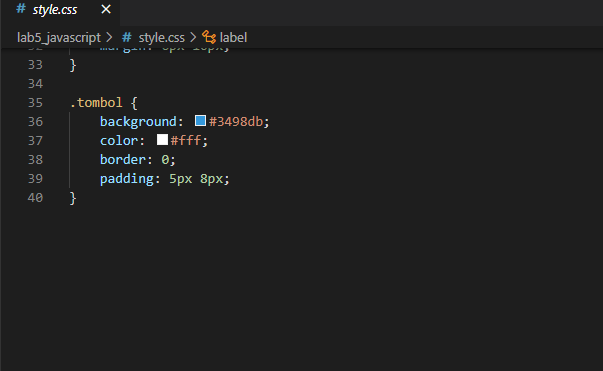

**Praktikum 5**

**Reka Hani Latifah Nurhasanah**

**312010343**

**TI.20.A.2**

**Langkah 1**

**Membuat dokumen HTML**

Membuat dokumen HTML dengan nama file `lab5_javascript.html` kemudian menambahkan kode seperti berikut

Maka tampilan akan seperti berikut

**Langkah 2**

**Javascript Dasar**

Pemakaian Alert sebagai property window seperti berikut

Maka tampilan akan seperti berikut

**Langkah 3**

Menambahkan kode pada method dalam objek seperti berikut

Maka tampilan akan seperti berikut

**Langkah 4**

**Pemakaian Prompt**

Menambahkan kode pada prompt seperti berikut

Maka tampilan akan seperti berikut

Kemudian setelah menekan tombol 'OK' pada kotak dialog pertanyaan dan memasukkan nama, maka tampilannya akan seperti berikut

**Langkah 5**

**Pembuatan Fungsi dan Cara Pemanggilannya**

Menambahkan kode pada fungsi dan cara pemanggilannya seperti berikut

Maka tampilannya akan seperti berikut

**Langkah 6**

**Dasar Pemrograman di Javascript**

Operasi dasar aritmatika seperti berikut

Kemudian setelah menekan tombol "Arithmetic" maka akan keluar tampilan seperti berikut

`Syntax`

**Langkah 7**

**Menyeleksi kondisi (if else)**

Menambahkan kode untuk menyeleksi kondisi (if else) seperti berikut

Maka tampilan akan seperti berikut

Jika kita memasukkan nilai kurang dari 60, maka hasilnya "Tidak Lulus" seperti berikut

Jika kita memasukkan nilai lebih dari 60, maka hasilnya "Lulus" seperti berikut

**Langkah 8**

**Penggunaan Operator Switch untuk Seleksi Kondisi**

Menambahkan kode pada fungsi operator switch untuk seleksi kondisi seperti berikut

Kemudian setelah menekan tombol "switch" maka akan keluar tampilan seperti berikut

Lalu saya memasukkan variabel bilangan "6" maka akan keluar tampilan seperti ini

`Syntax`

**Langkah 9**

**Pembuatan Form Input**

Menambahkan kode untuk membuat form input seperti berikut

Kemudian memasukkan variabel bilangan "8" maka akan keluar tampilan seperti berikut ini

`Syntax`

**Langkah 10**

**Pembuatan Form Button**

Menambahkan kode untuk membuat form button seperti berikut

Kemudian mencoba menekan tombol "Latar Belakang Hijau" serta tombol "Teks Kuning" maka akan keluar tampilan seperti berikut

`Syntax`

**Langkah 11**

**HTML DOM**

Pilihan menggunakan checkboc dengan perhitungan otomatis seperti berikut

Kemudian menekan tombol checklist pada menu yang tertera maka akan keluar tampilan seperti berikut

`Syntax`

## Pertanyaan dan Tugas

1. Buat script untuk melakukan validasi pada isian form.

#### Jawaban

**KODE HTML untuk Validasi Form**

`Syntax`

**KODE HTML HOME**

`Syntax`

**KODE CSS EKSTERNAL**

`Syntax`

**HASIL DATA YANG DI INPUT TIDAK LENGKAP**

**HASIL KETIKA DATA YANG DI INPUT LENGKAP**

